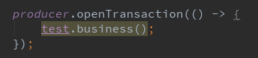
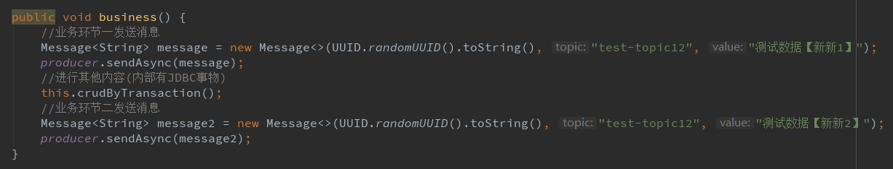
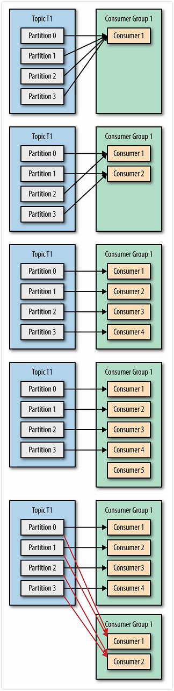
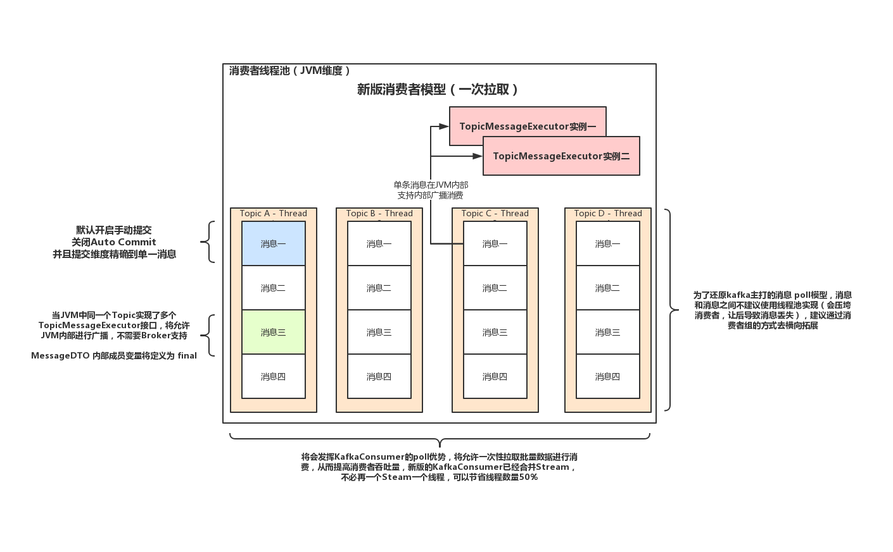

# `kafka_client介绍`
## **背景：**

## **目标：**

## **设计：**
### **生产者**
##### 支持官网的生产者模型:
 

**本项目事务支持：** 
开启事物方式： 
 
业务代码示例： 
 
如果有异常需要回滚，那么两次消息都将不会发送出去

### **消费者**
##### 支持官网的消费者模型:
 

 

##### 本次实现的消费者模型:

 