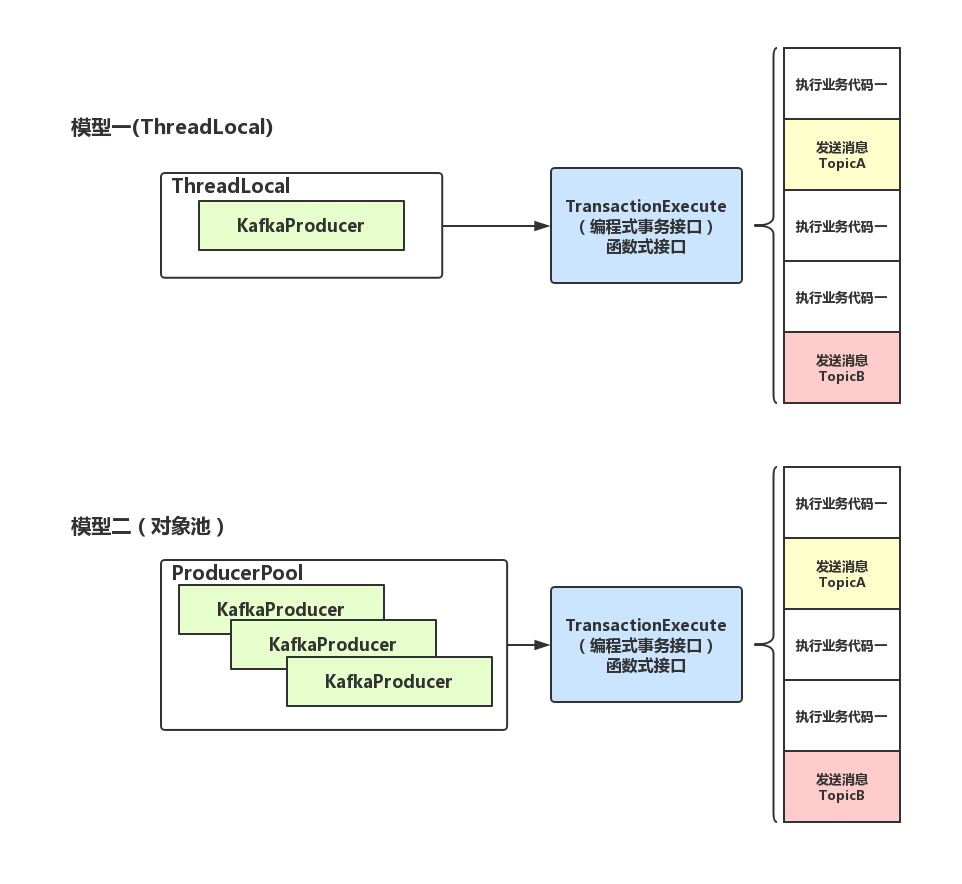

# `kafka_client介绍`
## **背景：**
kafka 具有吞吐量高,高压高堆积的特点,从 0.8.x 版本到 0.10.x 1.x 2.x版本,kafka本身发生了多次变革,修正了大多bug也引入了新功能和特性
,其client的使用也变的复杂多样,不同的人可能有不同的使用方式,由于开发的使用不当导致消息丢失,消息消费跟踪日志不足的事情屡屡发生

## **目标：**
本项目的目的,通过和spring的整合,提供一套配置完成开箱即用的client封装给开发者,通过配置的方式体验kafka的各种特性,同时topic和topic之间的消费又保持着一定的隔离性,彼此直接不干预,同时提供生成者消费者监控,和环境日志的记录,保证出现异常的时候开发有足够的日志信息

## **设计：**
### **生产者**
##### 支持官网的生产者模型:
 

**本项目生产者模型：** 
 

开启事物方式： 
 
业务代码示例： 
 
如果有异常需要回滚，那么两次消息都将不会发送出去

### **消费者**
##### 支持官网的消费者模型:
 

 

##### 本次实现的消费者模型:

 

### **项目结构**
 

 

 

### **项目结构依赖**

| 名称                | 版本    
| -----             |-----:   
| spring            | 5.1.5.RELEASE      
| commons-lang3     | 3.9     
| fastjson          | 1.2.58   
| lombok            | 1.18.6   
| kafka-clients     | 2.2.0   
| guava             | 27.1-jre    
